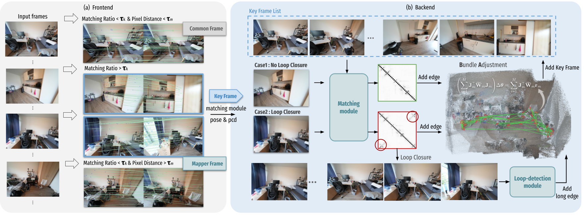
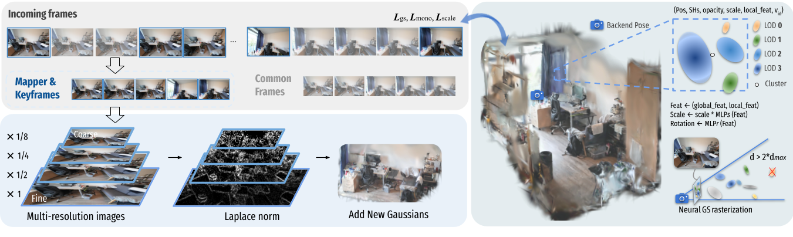

# ARTDECO: Towards Efficient and High-Fidelity On-the-Fly 3D Reconstruction with Structured Scene Representation

[Guanghao Li*](https://lightingooo.github.io/), [Kerui Ren*](https://cskrren.github.io/), [Linning Xu](https://eveneveno.github.io/lnxu/),
[Zhewen Zheng](https://github.com/QuantumEPR), [Changjian Jiang](https://scholar.google.com/citations?hl=en&user=V4miywEAAAAJ), [Xin Gao](https://gaoxin492.github.io/), [Bo Dai](https://daibo.info/), [Jian Pu†](https://scholar.google.com/citations?user=9pUCoOkAAAAJ&hl=en), [Mulin Yu†](https://mulinyu.github.io/), [Jiangmiao Pang](https://oceanpang.github.io/)  

## Overview

Frontend and backend modules. (a) Frontend: Images are captured from the scene and streamed into the front-end part. Each incoming frame is aligned with the latest keyframe using a matching module to compute pixel correspondences. Based on the correspondence ratio and pixel displacement, the frame is classified as a keyframe, a mapper frame, or a common frame. The selected frame, along with its pose and point cloud, is then passed to the back-end. (b) Backend: For each new keyframe, a loop-detection module evaluates its similarity with previous keyframes. If a loop is detected, the most relevant candidates are refined and connected in the factor graph; otherwise, the keyframe is linked only to recent frames. Finally, global pose optimization is performed with Gauss–Newton, and other frames are adjusted accordingly. We instantiate the matching module with MASt3R and the loop-detection module with Pi3.

Mapping process. When a keyframe or mapper frame arrives from the backend, new Gaussians are added to the scene. Multi-resolution inputs are analyzed with the Laplacian of Gaussian (LoG) operator to identify regions that require refinement, and new Gaussians are initialized at the corresponding monocular depth positions in the current view. Common frames are not used to add Gaussians but contribute through gradient-based refinement. Each primitive stores position, spherical harmonics (SH), base scale, opacity, local feature, dmax, and voxel index vid. For rendering, the dmax attribute determines whether a Gaussian is included at a given viewing distance, enabling consistent level-of-detail control.